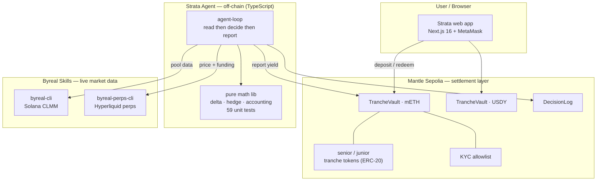
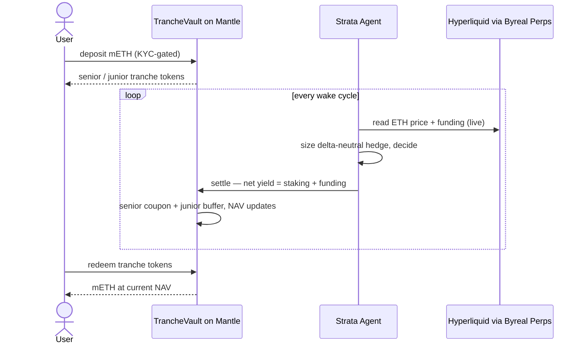

# Strata

> **AI-managed RWA yield, tranched on Mantle.** Strata turns idle yield-bearing Real-World
> Assets — **mETH** (Mantle staked ETH) and **USDY** (tokenized treasuries) — into
> **delta-neutral, risk-tranched yield**. An autonomous AI agent runs the strategy off-chain
> and settles the results on Mantle, where users hold **senior** (protected) or **junior**
> (levered) tranche tokens, with KYC-gated deposits and every decision verifiable on-chain.

**Track:** AI & RWA (Mantle) · **Status:** deployed + verified on Mantle Sepolia.

---

## The problem

Holders of yield-bearing RWAs mostly let them sit idle. **mETH** earns ~3–4% staking yield but
carries full ETH price risk; **USDY** earns treasury yield and does nothing else. There's no
easy, *risk-managed* way to put them to work.

## What Strata does

A pooled vault on Mantle that runs an **AI agent** executing the proven **delta-neutral LST
strategy** (the Ethena/USDe playbook) over Mantle's own RWAs:

1. Deposit **mETH** into a **senior** (protected, fixed-ish coupon) or **junior** (first-loss,
   levered) tranche → receive ERC-20 tranche tokens.
2. The agent earns the **staking yield** and **hedges the ETH price** with a short on the
   Hyperliquid ETH perp → **net delta-neutral yield**.
3. The agent reports the period's realized yield on-chain via `settle()`; the vault applies the
   **senior coupon + junior first-loss buffer**. Junior NAV rises with performance; senior is
   protected. (The **USDY** vault tranches native tokenized-treasury yield — same mechanism.)
4. Redeem tranche tokens for the RWA at the current NAV, any time.

The AI is an **autonomous, rules-based control loop** (not an LLM guessing trades): every cycle
it reads live data from both Byreal skills, sizes a **funding-aware** hedge, decides
hold/rebalance/skip with two-venue safety, and **reports realized yield on-chain** — so the AI's
output is auditable, not a UI claim.

---

## Architecture



**Three planes:**
- **On-chain (Mantle)** — the RWA tranche product: vaults, senior/junior tranche tokens, KYC
  allowlist, and every settlement. *Mantle is the settlement layer, not just a deploy target.*
- **Off-chain (the agent)** — reads live market data, computes the delta-neutral hedge, decides,
  and reports realized yield to Mantle.
- **Composed skills (Byreal)** — `byreal-perps-cli` (Hyperliquid) is the hedge venue and live
  funding source; `byreal-cli` (Solana CLMM) is the strategy-lab yield source. Both verified live.

## The yield loop



One command runs the full live cycle (read live data → decide → report yield on-chain):
```bash
cd tranche-strategy && pnpm agent-loop --ticks 0 --settle --settle-every 4
```

Show the tranche structure protect senior under a **loss** (real on-chain negative settles —
junior absorbs, senior NAV holds; `--breach` pushes past the buffer, default run self-recovers):
```bash
cd tranche-strategy && pnpm tsx scripts/breach-demo.ts --vault mETH
```

---

## Deployed contracts (Mantle Sepolia · chainId 5003)

| | mETH vault | USDY vault |
|---|---|---|
| **TrancheVault** | `0x7dF879Ff39AC3bAC696A38Da05aa19b51f9D1818` | `0x5BD8C01c04fbceB769B82b13d6A879a1081f75d1` |
| asset (RWA) | `0x83130374d16D5d1d95dB1ABE38cebF3F61c88329` | `0x9d3824f42dFF56D530Bfedd849c21CCc5b7128f5` |
| DecisionLog | `0x0f64Cb12512667BBcFDE913048fA68051e632abE` | `0xE71600e749bB899E7768ddfc962B70663dF3c9E0` |

All contracts are **verified** (source + ABI public) on Mantlescan:
<https://sepolia.mantlescan.xyz/address/0x7dF879Ff39AC3bAC696A38Da05aa19b51f9D1818#code>

### Trust-minimization (settlement safety)
The vault is the settlement layer for an off-chain AI agent, so it bounds what that agent can do:
- **Bounded settle** — a single `settle()` can move at most **`maxSettleBps` (20%)** of TVL, so a compromised key cannot drain the vault in one tx, and the AI's reported PnL is self-policed on-chain.
- **Role split** — the hot **`settler`** key only reports PnL (within the band); a separate cold **`owner`** holds pause / KYC / role rotation, capping the blast radius of an agent-key leak.
- **Solvency-backed** — every reported PnL is moved as real RWA (in if positive, out if negative), and withdrawals are always open, so depositors can exit. *Roadmap: multisig + timelock owner, proof-of-reserves oracle, continuous accrual.*

---

## Repo structure

```
mantle-vault/      Solidity (Foundry) — the RWA tranche product, ON MANTLE
                   TrancheVault.sol (senior/junior ERC-20 tranches, KYC gate, breach/orphan-safe
                   settlement, bounded settle + settler/owner split), DecisionLog.sol, mock RWA.
                   11 forge tests. Deployed + verified on Mantle.
tranche-strategy/  TypeScript — the AI agent + math (asset-agnostic, 59 unit tests)
                   agent-loop.ts (live delta-neutral loop + on-chain settle), adapters for
                   byreal-cli / byreal-perps-cli (verified live), the OpenClaw skill
web/               Next.js 16 + shadcn — /mantle (live EVM vaults), /live (the agent acting),
                   / (strategy lab), /manage (track record)
tranche-vault/     Anchor/Solana — the original pooled vault (9 on-chain tests); the EVM port's spec
```

## Quickstart

```bash
# 1) Web app
cd web && pnpm install && pnpm dev            # http://localhost:3000/mantle

# 2) The AI agent — full live cycle (read → decide → settle on Mantle)
cd tranche-strategy && pnpm install && pnpm agent-loop --ticks 0 --settle --settle-every 4

# 3) Tests
cd mantle-vault && forge install foundry-rs/forge-std OpenZeppelin/openzeppelin-contracts \
  && forge test                                   # 11 Solidity tests
cd tranche-strategy && pnpm test                  # 59 unit tests
```

On `/mantle` (MetaMask → Mantle Sepolia): **Connect → Faucet → Get approved (KYC) → Deposit → Redeem.**
See [`DEMO.md`](./DEMO.md) for a full walkthrough.

## Public deployment

**Frontend + backend (Vercel).** The `web/` app is a self-contained Next.js app (frontend +
API routes). Import the repo into Vercel and set:
- **Root Directory:** `web`
- **Env (optional):** `MANTLE_AGENT_KEY` = the vault-owner key (enables the testnet KYC
  auto-approve on `/mantle`). The live `/mantle` vault page works without it (read + deposit;
  KYC then needs a manual `setKyc`).

`/mantle` (the live RWA vault) and `/manage` work fully on Vercel. The `/` strategy-lab and
`/live` pages additionally use local Byreal CLIs / the running agent, so their live-market and
agent-stream features only light up when the agent runs locally.

**Contracts (already on Mantle Sepolia).** Verify them on the explorer with a free Etherscan
API key (Mantle is on the Etherscan V2 API):
```bash
cd mantle-vault && ETHERSCAN_API_KEY=<key> ./verify.sh   # key: https://etherscan.io/apidashboard
```

---

## How it meets the AI & RWA rubric (Part B)

| Criterion | How Strata meets it |
|---|---|
| **AI×RWA integration depth (15)** | AI runs delta-neutral risk management over mETH and **reports yield on-chain** — verifiable/auditable, not a chatbot wrapper |
| **Mantle as core layer (10)** | RWA + vaults + tranche tokens + KYC + every settlement live on Mantle |
| **Compliance awareness (10)** | on-chain **KYC/accredited allowlist** gating deposits + AI-assisted approval |
| **RWA path B — real-world validity (10)** | clear assets (mETH/USDY), real demand (idle RWAs → yield), end-to-end UX |
| **Execution & demo (5)** | deployed on Mantle, seeded, live, real addresses, open-source, tested |

## Tech stack

Solidity 0.8.28 · Foundry · OpenZeppelin · Next.js 16 · React 19 · shadcn/ui · viem · wagmi-free
EVM wallet · TypeScript · decimal.js · Anchor/Rust (Solana) · composes Byreal Agent Skills.

## Honest boundaries

- Testnet uses **mock** mETH/USDY (mainnet points at the canonical tokens).
- The agent's **read → decide → report** loop is live (real data, real Mantle txs); the
  fund-moving **hedge execution** is gated behind the `agent-token` signing skill (an onboarding
  dependency), and reported yield is currently agent-estimated from live rates.
- Contracts are **unaudited** hackathon code — guarded and tested (11 Solidity + 9 Anchor + 59
  unit tests), but real funds need an audit.
- This is **delta-hedged, not riskless** — a linear perp can't perfectly track every move.
